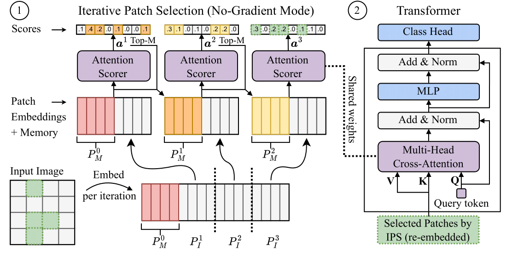

# Iterative Patch Selection

Official implementation of "Iterative Patch Selection for High-Resolution Image Recognition" in PyTorch.

Iterative Patch Selection (IPS) is a simple patch-based approach that decouples the consumed memory from the input size and thus enables the efficient processing of high-resolution images without running out of memory. IPS works in two steps:  First, the most salient patches of an image are identified in no-gradient mode. Then, only selected patches are combined by a transformer-based patch aggregation module to train the network. 

**Accepted at ICLR 2023**

arXiv: https://arxiv.org/abs/2210.13007    
openreview: https://openreview.net/forum?id=QCrw0u9LQ7

## Usage

IPS is applied to 3 datasets: Traffic signs, Megapixel MNIST and CAMELYON16.
The dataset can be set in `main.py`, by changing variable `dataset` to either traffic, mnist or camelyon.  
All other settings can be specified in `config/{dataset}.yml`.

To train a model, simply run: `python main.py`

The repo covers different data loading options (eager, eager sequential, lazy), positional encoding, tracking of efficiency metrics, single and multi-task learning and different loss functions.

## Notebook

We provide a simple example prepared as a Jupyter notebook (`ips_example.ipynb`) that can be imported into Google Colab, for example.

## Dataset specific considerations

**Traffic signs**: No specific considerations. The dataset will be downloaded automatically when running the main script.

**Megapixel MNIST**: Before training, the dataset needs to be created by running `data/megapixel_mnist/make_mnist.py`.  
For example: `python make_mnist.py --width 1500 --height 1500 dsets/megapixel_mnist_1500`.

**CAMELYON16**: Requires multiple preprocessing steps and significantly more resources (time, hardware). Before training, the following needs to be done:
1. Download of the CAMELYON16 dataset (up-to-date links can be found on Grand Challenge)
2. Computing Otsu thresholds by running `data/camelyon/otsu.py`
3. Extracting foreground coordinates by running `data/camelyon/foreground.py`
4. Pre-training with BYOL. We adapted the implementation of https://github.com/yaox12/BYOL-PyTorch
5. Extracting of features from the pre-trained model by running `data/camelyon/extract_feat.py`

## Citation
```bibtex
@inproceedings{bergner2022iterative,
  title={Iterative patch selection for high-resolution image recognition},
  author={Bergner, Benjamin and Lippert, Christoph and Mahendran, Aravindh},
  booktitle={International Conference on Learning Representations},
  year={2022}
}
```
